<h1 align="left">Hi There 👋! I am Rishi</h1>

  I’m a software developer who enjoys building practical, user-focused applications
  and exploring how technology can solve real-world problems. My interests include
  full-stack web development, system design, and continuously improving my
  problem-solving skills through hands-on projects and collaborative work.

<h2 align="left">About Me</h2>

🚀 <b>Currently building:</b> Sanjeevani 2.0 — a healthcare management platform
with appointment booking, SOS alerts, and medical records.
  

🧩 <b>Projects:</b> Developed complete web applications such as Sanjeevani
and DappRush Studios, working across UI design, frontend development,
backend integration, and overall project structure.
  

🛠️ <b>Tech focus:</b> Full-stack web development, responsive UI,
API integration, and database-driven systems.
  

🏆 <b>Hackathons & Activities:</b> Participated in multiple hackathons
and technical events, gaining experience in teamwork and rapid development.
  

📚 <b>Learning:</b> Machine learning fundamentals, web technologies,
system design, and software engineering best practices.
  

🤝 <b>Communities:</b> Active contributor and promoted associate in
college technical clubs.
  

⚡ <b>Fun fact:</b> I enjoy building creative tech projects and refining
user experiences.

  🌐 <b>Portfolio:</b>
  <a href="https://portfolio-beta-nine-eaus9jwxk6.vercel.app/">
    Visit my portfolio
  </a>

<h2 align="left">Skills & Tools</h2>

  <b>Languages:</b>
  Java, Go, Python, C++, C, JavaScript, TypeScript, SQL
    

  <b>Frameworks & Platforms:</b>
  React, Node.js, Express, Tailwind CSS, AWS (Basics), Git, GitHub
    

  <b>Web & Databases:</b>
  REST APIs, MySQL, MongoDB, HTML, CSS
    

  <b>Data Science / ML:</b>
  Python, NumPy, Pandas, Machine Learning Fundamentals
    

  <b>Certifications:</b>
  NPTEL – Machine Learning | Web Development Certification |
  Programming in C / C++

<h2 align="left">GitHub Statistics</h2>

  

  

 

<h2 align="left">GitHub Contribution Snake</h2>

  <picture>

    <source
      media="(prefers-color-scheme: dark)"
      srcset="https://raw.githubusercontent.com/Rishi122005/Rishi122005/output/github-snake-dark.svg"
    />

    <source
      media="(prefers-color-scheme: light)"
      srcset="https://raw.githubusercontent.com/Rishi122005/Rishi122005/output/github-snake.svg"
    />

    

  </picture>

<h2 align="left">Connect With Me</h2>

  📧 <b>Email:</b>
  <a href="mailto:codrishiriengs@gmail.com">
    codrishiriengs@gmail.com
  </a>
    

  💼 <b>LinkedIn:</b>
  <a href="https://www.linkedin.com/in/rishi122005/">
    linkedin.com/in/rishi122005
  </a>
    

  🌐 <b>Portfolio:</b>
  <a href="https://portfolio-beta-nine-eaus9jwxk6.vercel.app/">
    Visit my portfolio
  </a>

  Thanks for visiting! If you’re interested in collaborating on projects,
  discussing ideas, or building something meaningful together, feel free to reach out.
    
  <b>Let's connect 🚀</b>

